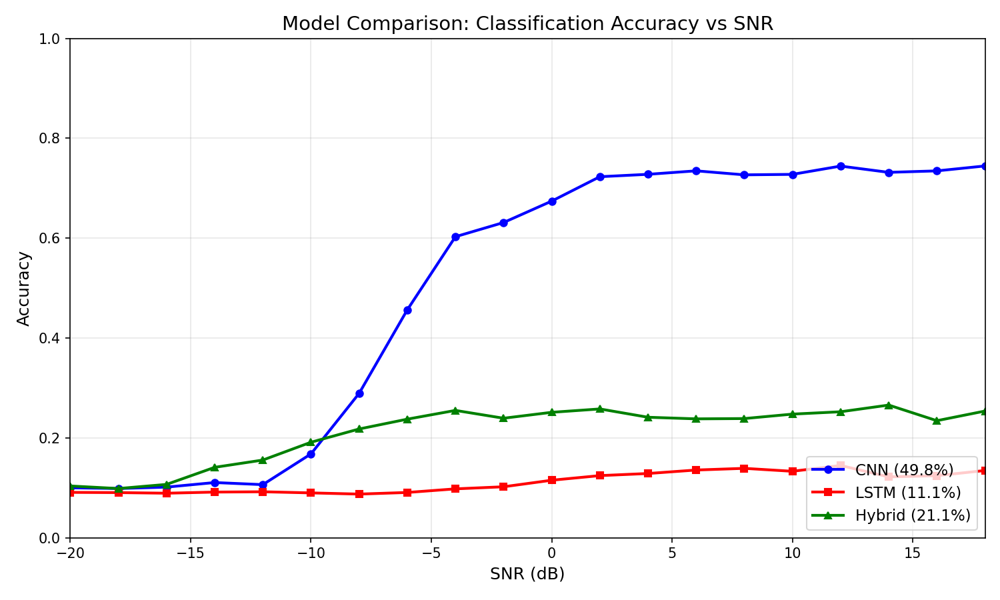

# Automatic Modulation Classification with Deep Learning

A comparative study of CNN, LSTM, and hybrid architectures for classifying radio signal modulation types from raw I/Q data using the RadioML 2016.10a dataset.

📄 **[Technical Report (PDF)](docs/AMC_Technical_Report.pdf)** | 📋 **[Project Summary (PDF)](docs/AMC_Project_Summary.pdf)**

## Results

| Model | Overall Accuracy | High SNR (≥0 dB) | Low SNR (<0 dB) |
|-------|------------------|------------------|-----------------|
| **CNN** | **49.8%** | **72.7%** | **26.6%** |
| Hybrid | 21.1% | 24.8% | 17.5% |
| LSTM | 11.1% | 13.0% | 9.2% |

**Key finding:** The 1D-CNN significantly outperforms both LSTM and hybrid architectures. The pure LSTM failed to learn meaningful features from raw I/Q data, while the hybrid model showed modest improvement due to its CNN component.



## Project Structure
```
├── docs/
│   ├── AMC_Technical_Report.pdf   # Full 5-page technical report
│   └── AMC_Project_Summary.pdf    # 2-page executive summary
├── data/                          # Dataset (not tracked)
├── figures/                       # Generated plots
├── models/                        # Saved model weights (not tracked)
├── results/                       # Experiment results (JSON)
├── 01_EDA.ipynb                   # Exploratory data analysis
├── 02_CNN.ipynb                   # CNN implementation
├── 03_LSTM.ipynb                  # LSTM and Hybrid implementation
├── 04_Comparison.ipynb            # Model comparison
├── requirements.txt
└── README.md
```

## Dataset

**RadioML 2016.10a** — A synthetic dataset generated with GNU Radio.

- 11 modulation types: 8PSK, AM-DSB, AM-SSB, BPSK, CPFSK, GFSK, PAM4, QAM16, QAM64, QPSK, WBFM
- SNR range: -20 dB to +18 dB (2 dB steps)
- 220,000 samples total (1,000 per modulation-SNR pair)
- Sample shape: 2 × 128 (I/Q channels × time steps)

Download: [Kaggle](https://www.kaggle.com/datasets/nolasthitnotomorrow/radioml2016-deepsigcom)

## Models

### 1D-CNN
Two convolutional layers with max pooling, followed by fully connected layers. Trained on full dataset for 15 epochs.

### LSTM
Single-layer LSTM processing I/Q samples as a 128-step sequence. Failed to learn — accuracy remained at random chance (~9%).

### Hybrid CNN-LSTM
CNN feature extractor followed by LSTM. The CNN component enabled learning, but did not outperform the pure CNN.

## Key Observations

1. **CNN excels at spatial feature extraction** — The convolutional layers effectively capture the local patterns in I/Q data that distinguish modulation types.

2. **LSTM struggles with raw I/Q input** — Without pre-extracted features, the LSTM cannot learn useful temporal patterns from the raw signal.

3. **QAM confusion** — QAM16 and QAM64 are frequently confused even at high SNR due to similar constellation structures.

4. **SNR threshold** — Below -10 dB, all models perform near random chance. Useful classification begins around -6 dB.

## Setup
```bash
# Clone the repository
git clone https://github.com/nabeegh-khan/amc-deep-learning.git
cd amc-deep-learning

# Create conda environment
conda create -n amc python=3.10
conda activate amc

# Install dependencies
pip install -r requirements.txt

# Download dataset from Kaggle and place in data/
```

## References

1. O'Shea, T.J., Corgan, J., Clancy, T.C. (2016). "Convolutional Radio Modulation Recognition Networks." EANN.
2. O'Shea, T.J., West, N. (2016). "Radio Machine Learning Dataset Generation with GNU Radio." GNU Radio Conference.
3. West, N.E., O'Shea, T.J. (2017). "Deep Architectures for Modulation Recognition." IEEE DySPAN.

## License

This project is for educational purposes. The RadioML dataset is licensed under CC BY-NC-SA 4.0.